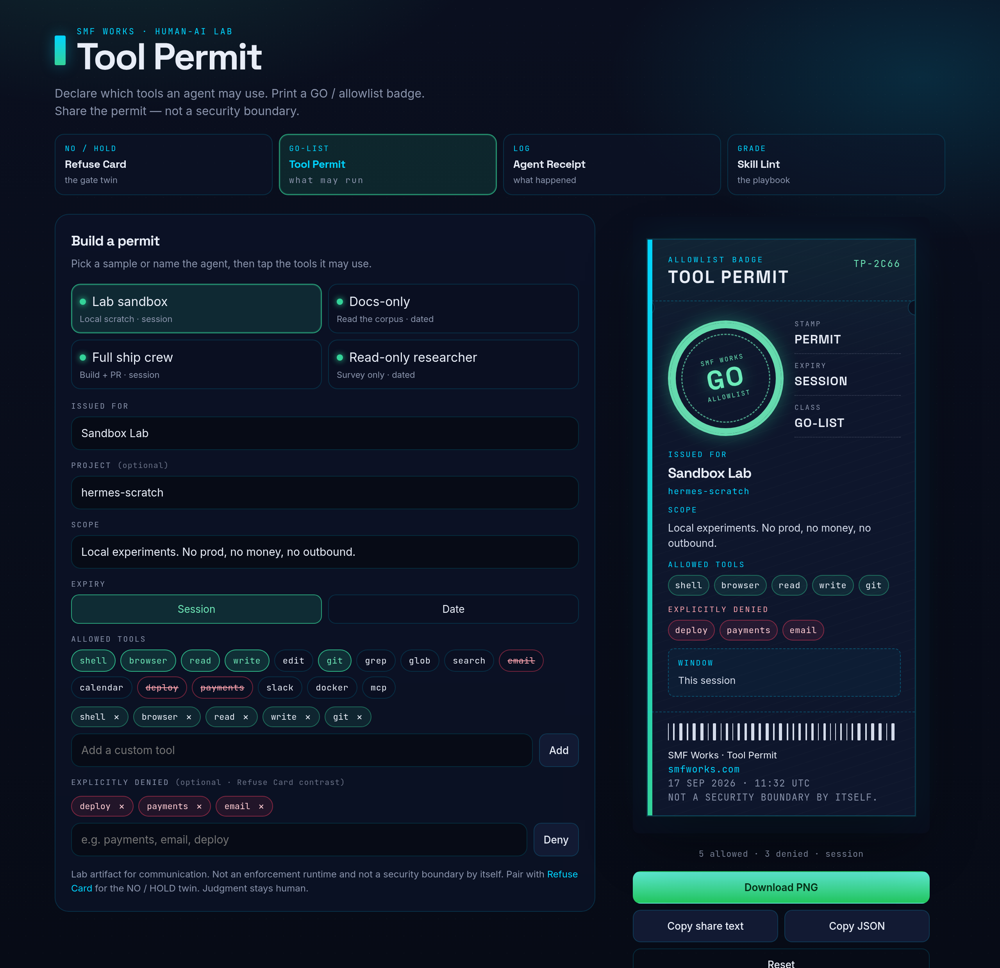
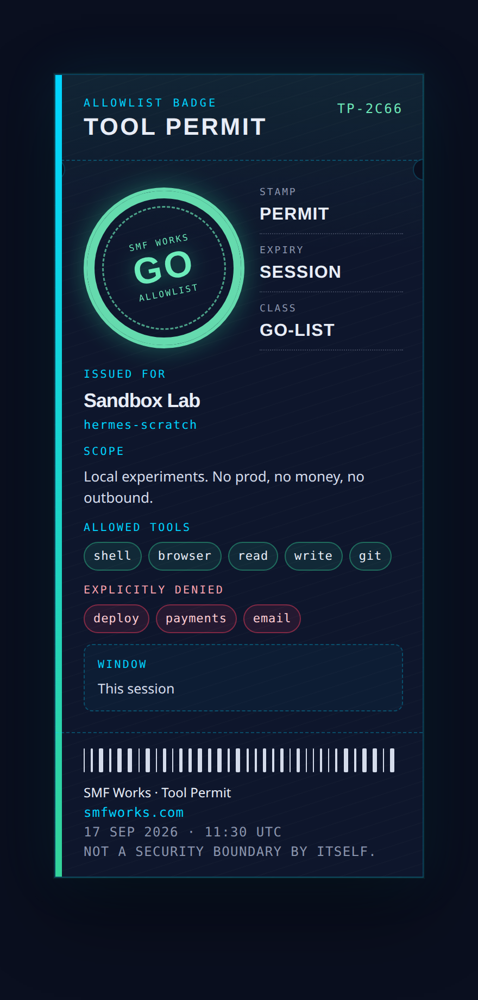
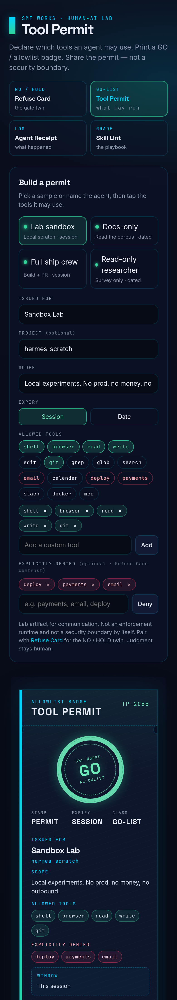

# Tool Permit

Declare which tools an agent may use → get a shareable **allowlist badge / permit card**.

The **GO-list** twin of [Refuse Card](https://github.com/smfworks/refuse-card). Name the agent, tap the tools it may touch, optionally stamp a short denied list, and print a dark card: PERMIT / ALLOWLIST, issued-for, scope, expiry. Built for posting on X and dropping next to a skill.

**Declare the GO-list. Print the permit. Share the bound — not a security boundary.**

[](LICENSE)

SMF Works viral kit:

1. **[Paste → Skill](https://github.com/smfworks/paste-to-skill)** ([demo](https://paste-to-skill.vercel.app)) — what to run
2. **[Skill Lint](https://github.com/smfworks/skill-lint)** — grade / fix
3. **[Refuse Card](https://github.com/smfworks/refuse-card)** — **NO / HOLD** twin
4. **Tool Permit (this)** — **GO / ALLOWLIST**
5. **[Agent Receipt](https://github.com/smfworks/agent-receipt)** ([demo](https://agent-receipt-green.vercel.app)) — what happened

## Screenshots

Desktop split (builder left, permit right). Mobile stacks the builder above the card.







## Why a permit?

Refuse Card stamps what must not run. Tool Permit is the other half of the sentence: which tools *may*. A badge is small enough to screenshot and specific enough to argue with — sandbox vs docs-only vs ship crew vs read-only researcher.

It is a **lab artifact for communication**. It is **not an enforcement runtime** and **not a security boundary by itself**. Pair it with a real sandbox, a skill refuse list, and a human. Judgment stays human.

## Quickstart

```bash
npm install
npm run dev
```

Open [http://localhost:5173](http://localhost:5173).

```bash
npm run build
npm run preview
npm test
```

Node 20+ (22 recommended). Client-side only — no auth, no backend, no API keys, no secrets.

## Use it

1. Pick **Lab sandbox**, **Docs-only**, **Full ship crew**, or **Read-only researcher**, or name your own agent.
2. Tap suggested tools (shell, browser, read, write, git, email, calendar, deploy, payments, …) or add a custom chip. Optional denied list for contrast with Refuse Card.
3. Choose **session** expiry or a calendar date.
4. **Download PNG**, **Copy share text**, or **Copy JSON** (machine-readable allowlist). **Reset** clears the compositor.

Other tools can emit the JSON schema below and skip the builder.

## Samples

Shipped in [`public/samples/`](public/samples/):

| File | Bound |
| --- | --- |
| `lab-sandbox.json` | Local scratch. Session. No deploy / payments / email. |
| `docs-only.json` | Read the corpus. Dated. No write / shell / git. |
| `full-ship-crew.json` | Build, test, open a PR. Session. Money stays human. |
| `read-only-researcher.json` | Survey only. Dated. Hands off the working tree. |

Load one in the app with `?sample=lab-sandbox`.

## Input / output schema

Canonical JSON Schema: [`public/schema/tool-permit.schema.json`](public/schema/tool-permit.schema.json)

Minimal allowlist:

```json
{
  "agent": "Sandbox Lab",
  "allowed": ["shell", "browser", "read", "write", "git"],
  "denied": ["deploy", "payments"]
}
```

Printed output (what the card represents):

| Field | Notes |
| --- | --- |
| `schema` | `smf.tool-permit.v1` |
| `id` | `TP-xxxx` serial |
| `agent` | Issued-for |
| `project` | Optional repo / desk |
| `scope` | One-liner bound |
| `expiry` | `{ "kind": "session" }` or `{ "kind": "date", "date": "YYYY-MM-DD" }` |
| `allowed` | GO-list. Denied wins on overlap. |
| `denied` | Optional contrast list |
| `issuedAt` | ISO-8601 UTC |
| `heuristic` | Always `true` — this is a demo printer |

Aliases accepted on ingest: `issuedFor` / `allowlist` / `refused`.

## Host a demo

Static files from `npm run build` (output: `dist/`).

Or Docker:

```bash
docker build -t tool-permit .
docker run --rm -p 8080:80 tool-permit
```

Then open [http://localhost:8080](http://localhost:8080).

## Stack

Vite + React + TypeScript. Permit serialization is client-side (no model, no keys). PNG export via `html-to-image`. Fonts: Inter, Space Grotesk, JetBrains Mono. Palette: navy `#0A0F1F`, cyan `#00D4FF`, GO green `#34D399`.

## Built by SMF Works

[SMF Works](https://smfworks.com) is a human-AI research lab. We publish what we learn, ship open agent tools, and install stacks on hardware you own.

Intelligence is abundant. Judgment is the product.

- Lab: [smfworks.com](https://smfworks.com)
- GitHub: [github.com/smfworks](https://github.com/smfworks)
- X: [@MichaelGannotti](https://x.com/MichaelGannotti)
- Twin: [Refuse Card](https://github.com/smfworks/refuse-card) — NO / HOLD
- Sister: [Agent Receipt](https://github.com/smfworks/agent-receipt) — what happened

MIT licensed. No medical or legal claims. This is a shareable allowlist badge, not an audit, not a sandbox, not advice, and not a hosted agent.

## License

[MIT](LICENSE) © 2026 SMF Works
